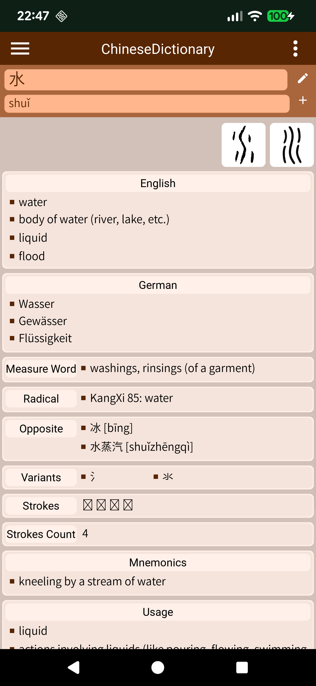
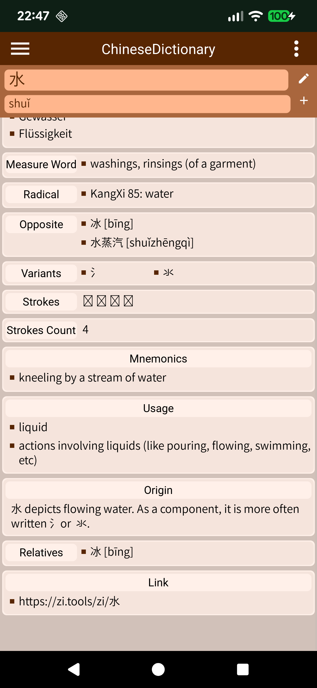
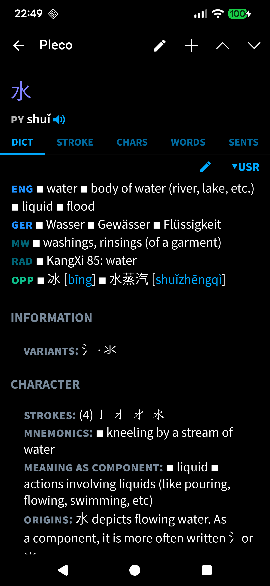
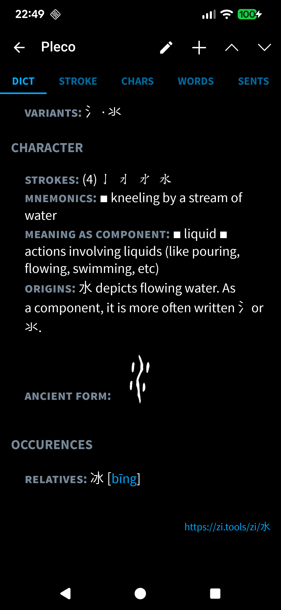
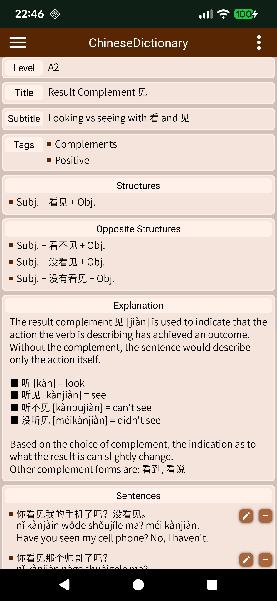
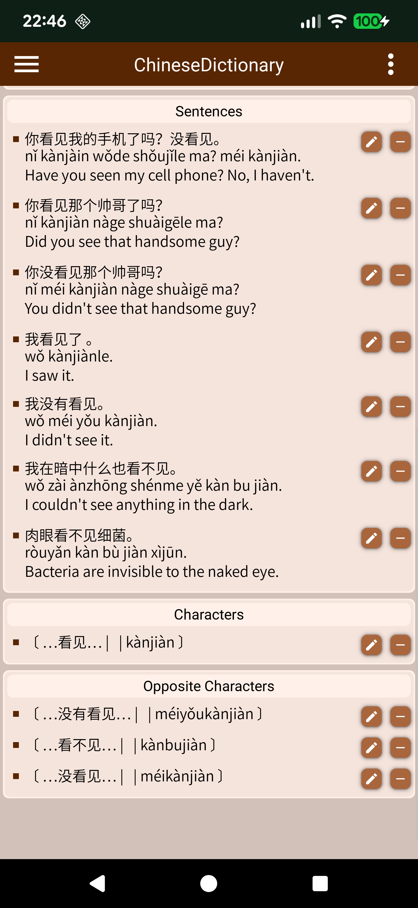
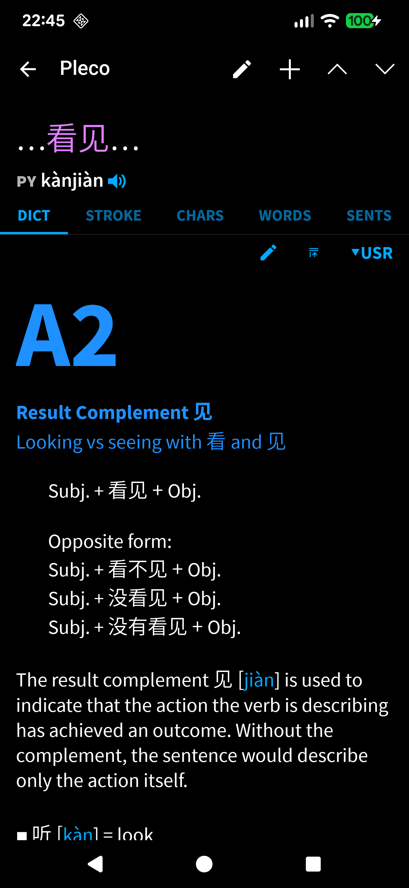
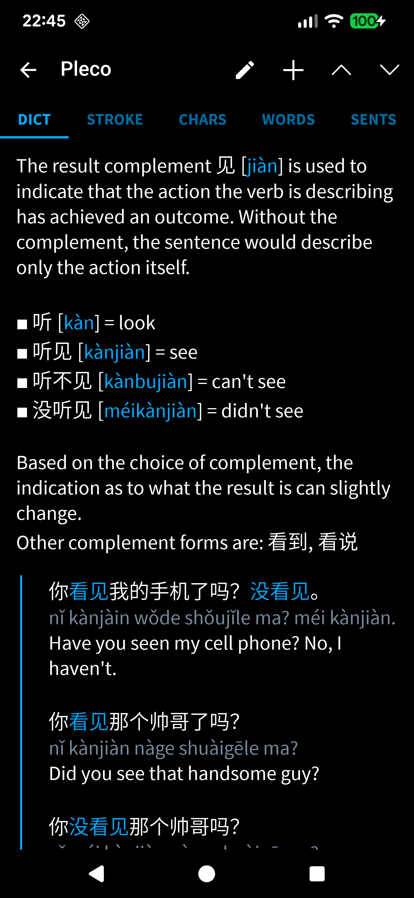
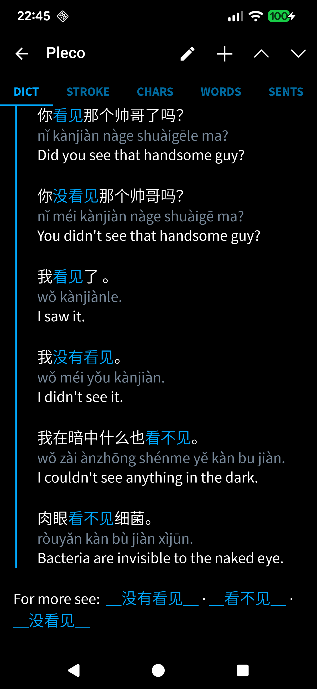

# ChineseDictionary (ChD) 

This application is capable of storing chinese vocabulary and grammar rules. The goal is to be able to personally note down information for newly learned chinese characters and link them to related grammar rules. Character Images (in SVG format) can also be uploaded.

Another aspect is the compatibility of the ChD dictionaries with one very popular dictionary for Mandarin and Cantonese learners, called [Pleco](https://www.pleco.com/)
. This app, available only for android and iOS, makes the creation of a personalized dictionary possible. By exporting a personal dictionary from ChD, a txt file is created which can then be imported by Pleco.

Since Pleco is only available for android and iOS, the advantage of ChD is, that you can run the python script on Windows and Linux, while the apk file can be run on android. It is possible to share dictionary information among each device by using backup and restore.  

## Table of Contents

- [ChineseDictionary (ChD) ](#chinesedictionary-chd-)
  - [Table of Contents](#table-of-contents)
  - [Installation](#installation)
    - [Requirements](#requirements)
    - [Build Application](#build-application)
    - [First Steps (APK)](#first-steps-apk)
  - [Templates](#templates)
    - [template for character dictionaries](#template-for-character-dictionaries)
    - [template for grammar list](#template-for-grammar-list)
  - [Demonstration](#demonstration)
    - [Character Dictionary](#character-dictionary)
    - [Grammar Dictionary](#grammar-dictionary)
    - [Settings](#settings)
  - [Pleco Compatibility](#pleco-compatibility)
  - [Plans for the future](#plans-for-the-future)

## Installation

### Requirements
To be able to run the main.py, the following packages have to be installed.

```python
# Python version: 3.12.9
pip install kivy==2.3.1
pip install https://github.com/kivymd/KivyMD/archive/master.zip  # kivymd (Version: 2.0.1.dev0)
pip install materialyoucolor==2.0.10
```
### Build Application
Buildozer is used to create the .apk for android devices. The buildozer.spec specifies how the application will be compiled. Inside the Workspace, run these commands to build the application.

```
buildozer -v android debug # builds the debug APK
buildozer android release # builds AAB for public distribution  
```
PyInstaller is the tool that bundles the application and all its dependencies into a single, standalone executable file.

```
pyinstaller --clean ChD.spec
```
To display the application icon on a linux desktop and make it launch the executable, create the file `~/.local/share/applications/chd.desktop` in your home directory. As app icon is recommended to use `appdata/images/book_icon.png`.

The chd.desktop file would contain these following lines:
```
[Desktop Entry]
Name=ExampleApp
Type=Application
Exec=/path/to/executable
Icon=/path/to/icon.png
Categories=Utility;
Terminal=false
```

### First Steps (APK)

Before doing anything, the access to storage has to be granted. This is because all the information on characters and grammar will be stored locally. The next step is to determine where these files will be stored (app directory). This can be changed in the settings.

<div style="display: flex; gap: 10px;">
  
  
  
</div>

## Templates

Templates are used to convert entries into txt files that are compatible with the Pleco app. This step involves understanding Pleco syntax. It has been said, that the syntax one can use to beautify personalized dictionaries in Pleco is not meant for public usage. That is the reason why it is quite difficult to comprehend. Instructions for color, font style and positioning of text are difficult to understand. The idea behind using a template is that each instruction is clearly stated and can be easily changed by other users with no knowledge of the underlying rules for the syntax. 

In simple terms, each template can contain multiple components and environments. A component is either a header (H) or content, which can be a list (L), an integer number (I) or plain text (T). An environment, positions the text on the left or right side or with an indent. 

```
Header: <H:[font|color|visibility]:TEXT>
Content: <L:[delimiter|newline|size]:category> 

Environment: <position>{...}<E>

End of line: <E>
New line: <N>
Additional character: <(> or <)>
```

Headers have an interesting function, where based on what visibility they are described to have and based on whether or not the character entry has information for that category, the header and the following content might not be presented. This is necessary because otherwise every information category would be visible for every character / dictionary entry even when most of that information is missing or not available. To keep things easy and simple, only those categories that have information input are shown in the Pleco App. 

### template for character dictionaries
```
<H:[b|grey|hidden]:TRANSLATION>
<LEFT>{
<H:[nb|blue|available]:ENG ><L:[point|l|normal]:english><E>
<H:[nb|blue|available]:GER ><L:[point|l|normal]:german><E>
<H:[nb|teal|available]:MW ><L:[point|l|normal]:measure_word><E>
<H:[nb|teal|available]:RAD ><L:[point|l|normal]:radical><E>
<H:[nb|green|available]:OPP ><L:[point|l|normal]:opposite><E>
}<E>
<H:[b|grey|available]:INFORMATION>
<INDENT>{
<H:[nb|grey|available]:CLASSIFIER: ><L:[dot|l|normal]:classifier><E>
<H:[nb|grey|available]:VARIANTS: ><L:[dot|l|normal]:variants><E>
<H:[nb|grey|available]:DISTINGUISH FROM: ><L:[dot|l|normal]:others><E>
<H:[nb|grey|available]:DICTIONARY ENTRIES: ><N><L_LINK:[dot|l|normal]:dict_entries><E>
}<E>
<H:[b|grey|available]:CHARACTER>
<INDENT>{
<H:[nb|grey|available]:STROKES: ><(><I:[n|none|normal]:strokes_count><)><T:[n|none|normal]:strokes><E>
<H:[nb|grey|available]:COMPONENTS: ><N><L:[point|nl|normal]:components><E>
<H:[nb|grey|available]:MNEMONICS: ><L:[point|l|normal]:mnemonics><E>
<H:[nb|grey|available]:MEANING AS COMPONENT: ><L:[point|l|normal]:usage><E>
<H:[nb|grey|available]:ORIGINS: ><T:[n|none|normal]:origin><E>
<H:[nb|grey|available]:ANCIENT FORM: ><L:[none|l|big]:ancient><E>
}<E>
<H:[b|grey|available]:OCCURENCES>
<INDENT>{
<H:[nb|grey|available]:RELATIVES: ><L:[dot|l|normal]:relatives><E>
<H:[nb|grey|available]:WORDS: ><L:[dot|l|normal]:words><E>
}<E>
<H:[b|grey|hidden]:LINKS>
<RIGHT>{
<L_LINK:[none|nl|small]:link><E>
}<E>
```

How it is presented in the ChD and in the Pleco app:
<div style="display: flex; gap: 10px;">
  
  
  
  
</div>

### template for grammar list

```
<T:[b|blue|big]:level><E><N>
<T:[b|blue|normal]:title><E><N>
<T:[n|blue|normal]:subtitle><E>
<MARK>{
<L:[none|nl|normal]:structures><E>
<N><N><E>
<H:[n|none|available]:Opposite form: ><N><L:[none|nl|normal]:opposite_structures><E>
}<E>
<T:[n|none|normal]:explanation><E><N><N>
<MARKLINE>{
<L:[none|nl|normal]:sentences><E>
}<E>
<LEFT>{
<H:[n|none|available]:For more see:  ><L_LINK:[d|l|normal]:all_other_char><E>
}<E>
```
How it is presented in the ChD and in the Pleco app:

<div style="display: flex; gap: 10px;">
  
  
  
  
  
</div>

## Demonstration

### Character Dictionary

ChD allows the creation of multiple dictionaries. This can be helpful to separate one-character symbols from words or any other distinction that might be necessary. The dictionary can be sorted, filtered and searched through.  
In the preview of each character, the chinese character symbols are shown and a part of the english translation. When available, the character image is shown on the side. There you also find category symbols that can be filtered for. 

Filter:
 - translated character (any character that has a translation)
 - radical (any character that is considered a radical, has information about the radical)
 - measure word (a character that is used as a measure word in the chinese language)
 - grammatical (in case the character is relevant to a grammatical rule)

<div style="display: flex; gap: 10px;">
  
  
  
</div>

### Grammar Dictionary

There is only one list of grammar rules. Each rule should be allocated to a certain learning level. Shown here are the rules for level A1. When no level is selected, only rules without a level would be selected. When searching for a grammar rule, text from the title, subtitle and tags can be used. 

<div style="display: flex; gap: 10px;">
  
  
  
</div>

### Settings

The theme and design palette can be changed through settings. Changes here will be saved to a settings.json file in .config of the app directory.

<div style="display: flex; gap: 10px;">
  
  
  
</div>

## Pleco Compatibility

Based on templates that were created to determine font style and other design choices, the information stored for the characters in a dictionary or even a grammar rule is converted to a txt file using Pleco specific syntax. 

This is how a character entry looks in ChD and in Pleco.
<div style="display: flex; gap: 10px;">
  
  
  
  
</div>

\
This is how a grammar entry looks in ChD and in Pleco.

<div style="display: flex; gap: 10px;">
  
  
  
  
  
</div>

## Plans for the future

- Dictionary Settings
  - categories: add, rename, remove
  - templates: add, remove, edit
- Practice sessions for Vocabulary
    - give each dictionary entry a personal score (from 1-5 how easy)
    - decide whether to test for translation, character recognition, writing
    - steps
        - select dictionary
        - select level
        - go through all cards in that level until you don't want anymore 
        - show hint and reveal rest upon tap
        - choose whether to leave at same level or choose another
- Sentences (Conversations)
    - the idea is to have a storage of conversations for different topics (maybe A1 - C2 or HSK)
        - example: Hobbies (A1), Hobbies (A2), Small Talk (A2), Small Talk (C1), ...
    - switch between chinese, pinyin, translation
    - tap on sentence to see rest 