# ChineseDictionary (ChD) 

This application is capable of storing chinese vocabulary and grammar rules. The goal is to be able to personally note down information for newly learned chinese characters and link them to related grammar rules. Character Images (in SVG format) can also be uploaded.

Another aspect is the compatibility of the ChD dictionaries with one very popular dictionary for Mandarin and Cantonese learners, called [Pleco](https://www.pleco.com/)
. This app, available only for android and iOS, makes the creation of a personalized dictionary possible. By exporting a personal dictionary from ChD, a txt file is created which can then be imported by Pleco.

Since Pleco is only available for android and iOS, the advantage of ChD is, that you can run the python script on Windows and Linux, while the apk file can be run on android. It is possible to share dictionary information among each device by using backup and restore.  

## Installation

### Requirements
To be able to run the main.py, the following packages have to be installed.

```python
pip install kivy==2.3.1
pip install https://github.com/kivymd/KivyMD/archive/master.zip  # kivymd (Version: 2.0.1.dev0)
pip install materialyoucolor==2.0.10
```
### Build Application
Buildozer is used to create the .apk for android devices. The buildozer.spec specifies how the application will be compiled. Inside the Workspace, run these commands to build the application.

```python
buildozer -v android debug # builds the debug APK
buildozer android release # builds AAB for public distribution  
```

### First Steps (APK)

Before doing anything, the access to storage has to be granted. This is because all the information on characters and grammar will be stored locally. The next step is to determine where these files will be stored (app directory). This can be changed in the settings.

<div style="display: flex; gap: 10px;">
  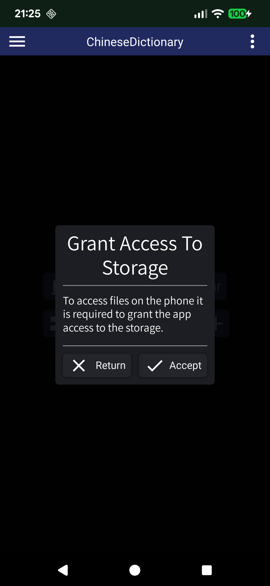
  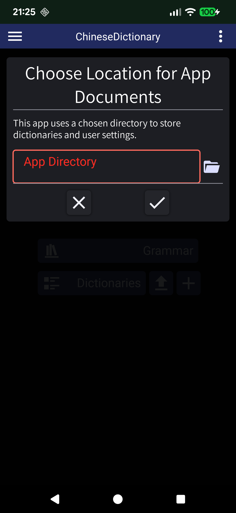
  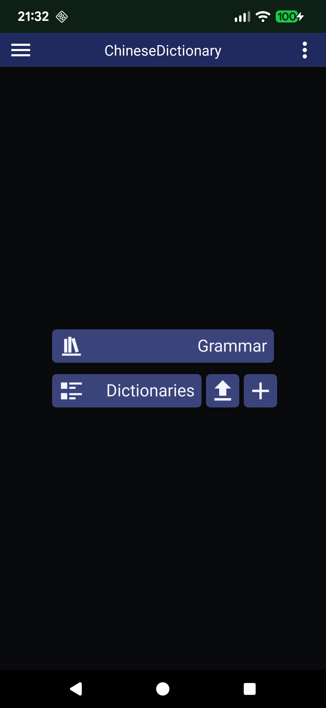
</div>


## Demonstration

### Character Dictionary

ChD allows the creation of multiple dictionaries. This can be helpful to separate one-character symbols from words or any other distinction that might be necessary. The dictionary can be sorted, filtered and searched through.  
In the preview of each character, the chinese character symbols are shown and a part of the english translation. When available, the character image is shown on the side. There you also find category symbols that can be filtered for. 

Filter:
 - translated character (any character that has a translation)
 - radical (any character that is considered a radical, has information about the radical)
 - measure word (a character that is used as a measure word in the chinese language)
 - grammatical (in case the character is relevant to a grammatical rule)

<div style="display: flex; gap: 10px;">
  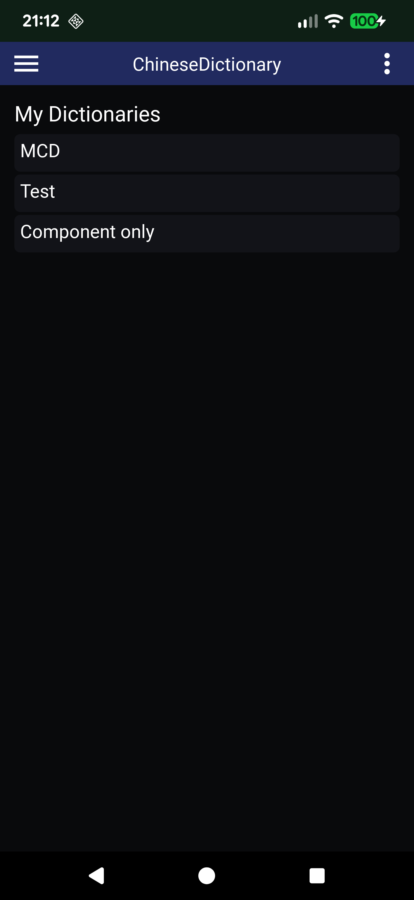
  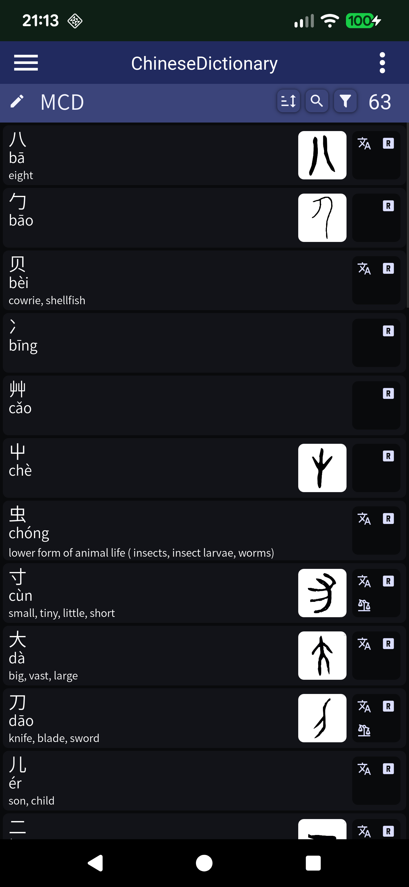
  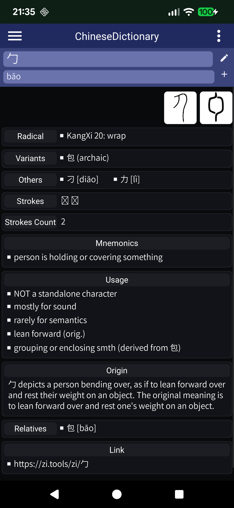
</div>

### Grammar Dictionary

There is only one list of grammar rules. Each rule should be allocated to a certain learning level. Shown here are the rules for level A1. When no level is selected, only rules without a level would be selected. When searching for a grammar rule, text from the title, subtitle and tags can be used. 

<div style="display: flex; gap: 10px;">
  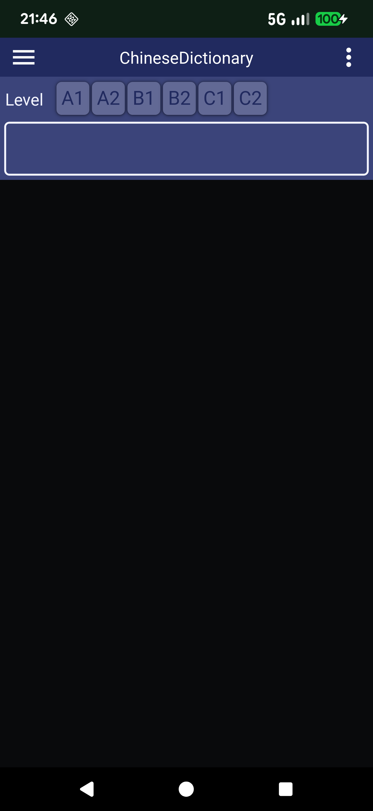
  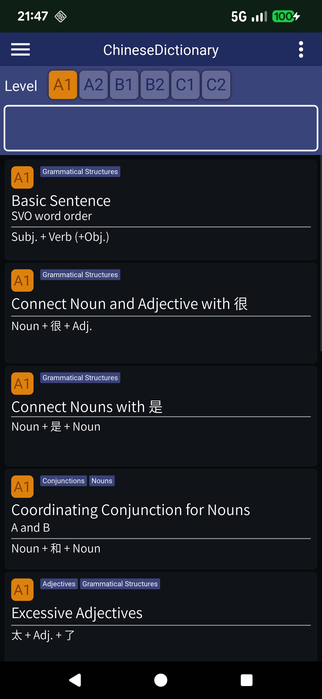
  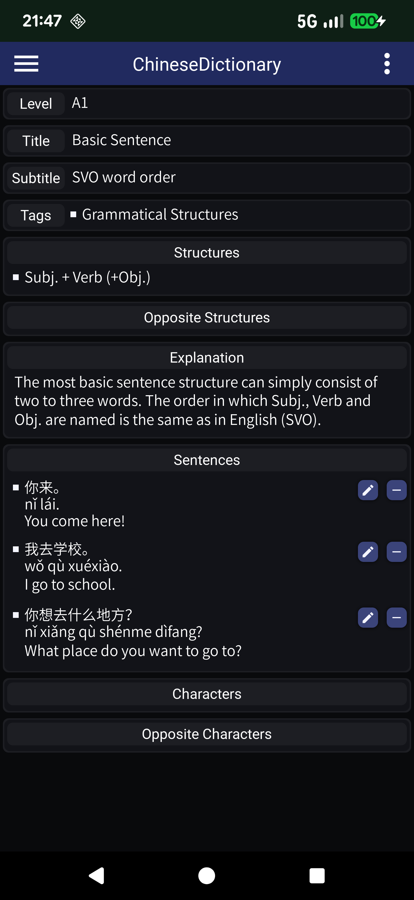
</div>

### Settings

The theme and design palette can be changed through settings. Changes here will be saved to a settings.json file in .config of the app directory.

<div style="display: flex; gap: 10px;">
  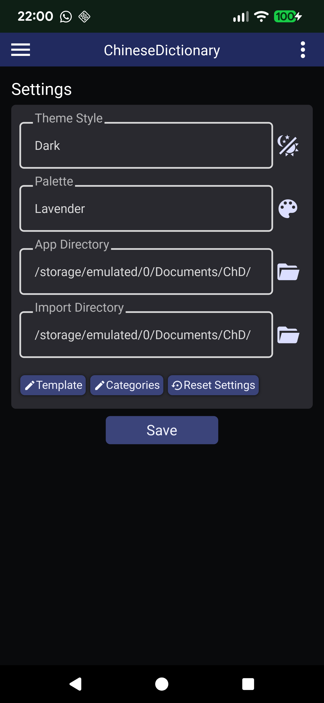
  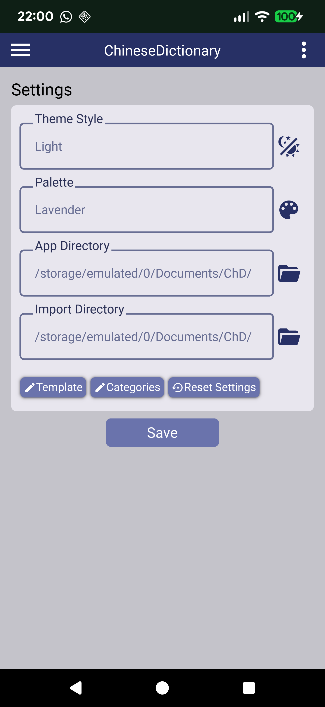
  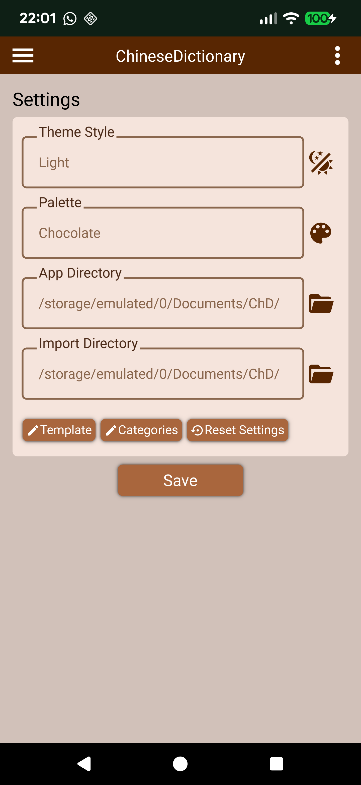
</div>